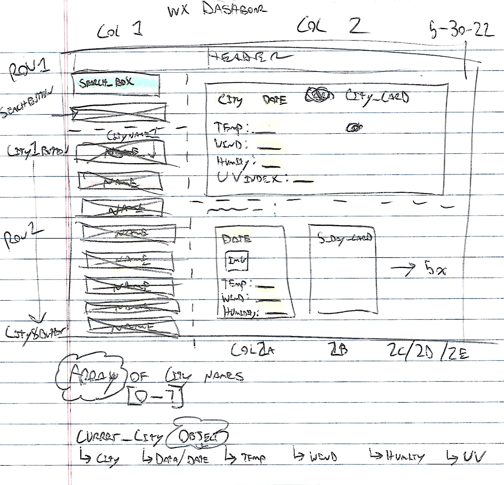

<h2 align="center">Wx Dashboard</h2>

---

<h5 align="center">

💼 Module 6 Challenge 💼 
By Clayton Skaggs 
(WW22.2) / May 31st 2022

Version 0.2</h5>

 
 

---

<h3 align="center">🚀 🚀 Deployment Information 🚀 🚀</h3>

<a href="https://desertcow.github.io/WxDashboard">desertcow.github.io/WxDashboard/</a>

---

 
 
 
 
 
 

<h3 align="center">🧙‍♂️ 🧙‍♂️ User Story 🧙‍♂️ 🧙‍♂️</h3>

----

<b>AS A</b> traveler 
<b>I WANT</b> to see the weather outlook for multiple cities 
<b>SO THAT</b> I can plan a trip accordingly

 
 
 

<h3 align="center">🌟 🌟 Acceptance Criteria 🌟 🌟</h3>

---

 <b>GIVEN</b> a weather dashboard with form inputs  

<b>WHEN</b> I search for a city 
✔️ THEN I am presented with current and future conditions for that city and that city is added to the search history 
<b>WHEN</b> I view current weather conditions for that city  
✔️ THEN I am presented with the city name, the date, an icon representation of weather conditions, the temperature, the humidity, the wind speed, and the UV index 
<b>WHEN</b> I view the UV index 
✔️ THEN I am presented with a color that indicates whether the conditions are favorable, moderate, or severe 
<b>WHEN</b> I view future weather conditions for that city 
✔️ THEN I am presented with a 5-day forecast that displays the date, an icon representation of weather conditions, the temperature, the wind speed, and the humidity  
<b>WHEN</b> I click on a city in the search history 
✔️ THEN I am again presented with current and future conditions for that city 
<b>WHEN</b> I refresh the page 
✔️ THEN the saved events persist 
 
 
 

<h3 align="center">📐 📐 Mock Up 📐 📐</h3>

---

  

<h3 align="center">✏️ ✏️ Wire Frame ✏️ ✏️</h3>

---

  

<h3 align="center">⚡ ⚡ App Demo ⚡ ⚡</h3>

---

  

 
 
 
 

 
 
